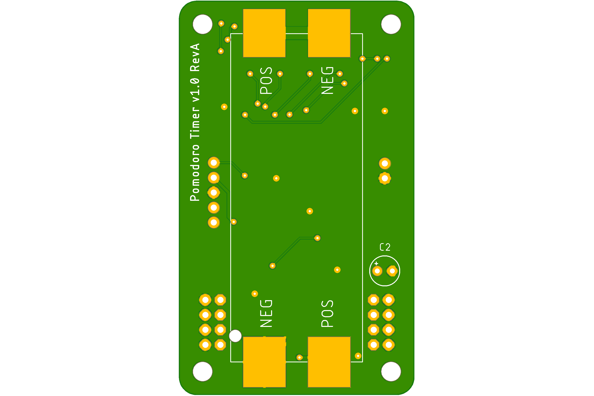

# Pomodoro Timer

This simple project was requested by a client.

### Step 1. Hardware time preset

Produce a Pomodoro Timer where you can set the working time and rest time

The client proposed a set of jumper headers to configure timers along with a sketch of the hardware.

<table>
  <tr>
    <td> </td>
    <td> </td>
  </tr>
</table>

Timers value are hardcoded 

Working time

- 15 minutes
- 30 minutes
- 60 minutes
- 90 minutes

Relax time

-  0 min
-  5 min
- 10 min
- 15 min

A row of LED are used to display the state of the timers.

### Step 2. Start timer

User clicks button to start timer

User hears sound from buzzer

LED progress bar turned on 

- Logic of the LED progress bar
    - Countdown progress bar
        - Ex: 30 minutes timer
        - 10 LEDs are on
        - the last one 10th is flashing
        - Every 3 minutes (time/amount of leds) 1 led turn off, after 3 minutes only 9 are on, the 9th is flashing

### Step 3. Timer is over

Once working timer is over:

- All progress bar LEDs flash
- Buzzer produce sound

Then User click button and Relax(Rest) timer began with the same logic

- Led progress bar has different color
- Once Rest timer finished - another melody is playing

To stop timer the User must hold the button pressed for 3 seconds. 

No pause function needed

### Power requirements

Ideally make it run from a tiny battery like CR2032 or 2-3 AAA Batteries.

### Enclosure requirements

No enclosure or enclosure built from PCB

### Size requirements

Less than 85 mm x 50mm 

## Proposal

 - Use a lowcost <a href="Firmware/pomodoro-pic16f15355/docs/PIC16F-LF-15354-55-Data-Sheet-DS40001853.pdf">pic16lf15355</a> SOIC 28 MCU which can be powered from 1.8v-5v, running from internal oscillator and able to idle at very low current.
 - Use 7 red/green bi-color, low power LEDs 
 - Use 2 AAA Batteries in series at 2v-3v to extend runtime and reduce end user cost over lithium CR2032 cell.
 - Use Microchip MPLAB-X, XC8 and Pickit5 for development.
 - 67mm x 40mm board area, battery holder mounted on the back.

<table>
  <tr>
    <td> </td>
    <td> </td>
  </tr>
</table>
